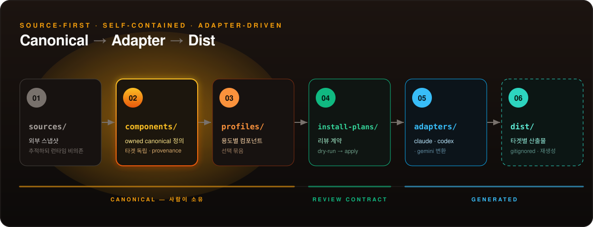
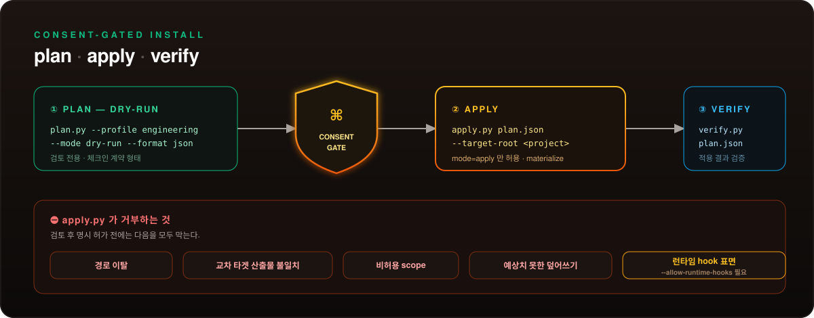

<!-- ──────────────── HERO BANNER ──────────────── -->
<div align="center">


<br/>

<!-- Project badges -->


<br/><br/>

<!-- Tagline -->
<h3>
  오픈소스를 가져와 내 방식대로 다시 조립하고,<br/>
  <b>원본 없이도 동작하도록</b> 만드는 harness engineering 툴킷
</h3>

<br/>

<!-- Tech stack -->
<p>
  
  
  
  
  
  
  
  
</p>

<br/>

<!-- Quick navigation -->
<p>
  <a href="#-아키텍처"></a>
  <a href="#-빠른-시작"></a>
  <a href="#-install-plan-안전장치"></a>
  <a href="#-컴포넌트-카탈로그"></a>
  <a href="#-사용-시나리오"></a>
</p>

</div>

<br/>

<!-- ────────────── DIVIDER ────────────── -->


<br/>

## 🔥 철학과 원칙

> 외부 source를 **스냅샷으로 고정**해 두고, 내 소유의 canonical 컴포넌트로 **다시 조립**한 뒤,
> adapter가 각 CLI 타겟용 산출물을 **생성**함. 원본이 사라져도 harness는 그대로 동작함.

<table>
<tr>
<td width="50%" valign="top">

#### 🟠 Source-first

외부 source는 `sources/`에 스냅샷으로 보존·추적됨.<br/>
원본은 **출처 기록의 대상**일 뿐, 런타임 의존 대상이 아님.

</td>
<td width="50%" valign="top">

#### 🟢 Self-contained

모든 컴포넌트는 `provenance.map.yml`을 갖고<br/>
`runtime_dependency_on_sources: false`가 **강제**됨.<br/>
런타임에 외부 패키지 설치가 필요 없음.

</td>
</tr>
<tr>
<td width="50%" valign="top">

#### 🔵 Adapter-driven

하나의 canonical 컴포넌트가<br/>
**Claude · Codex · Gemini별로 다른 산출물**을 생성함.<br/>
타겟 추가는 adapter 하나로 끝남.

</td>
<td width="50%" valign="top">

#### 🟣 Generated stays out of Git

`dist/`는 adapter / install 명령으로 **재생성**되는<br/>
파생 산출물이므로 Git에 추적하지 않음.<br/>
source markdown은 원본, `.html`·`.render.json`은 파생물.

</td>
</tr>
</table>

> 💡 **Strict runtime truth** — capability는 `observed_cli_version` · `official_docs_source` ·
> `isolated_workspace_probe` · `captured_probe_evidence`가 모두 모일 때만 `runtime_supported`로
> 승격됨. 추측이 아니라 관측된 증거 기반임.

<br/>

<!-- ────────────── DIVIDER ────────────── -->


<br/>

## 🧬 아키텍처

> `sources → components → profiles → install-plans → adapters → dist`.
> 사람이 소유하는 canonical 영역과 자동 생성 영역의 경계가 명확함.

<p align="center">
  
</p>

<table>
<thead>
<tr><th>경로</th><th>역할</th></tr>
</thead>
<tbody>
<tr><td><code>sources/</code></td><td>외부 source 스냅샷과 <code>registry.yml</code> — 추적하되 런타임 비의존</td></tr>
<tr><td><code>components/</code></td><td>owned canonical 컴포넌트 — skills · agents · hooks · rules · workflows (타겟 독립)</td></tr>
<tr><td><code>profiles/</code></td><td>용도별 컴포넌트 선택 묶음 — <code>engineering</code> · <code>harness-maintenance</code> · <code>scm</code> · <code>minimal</code></td></tr>
<tr><td><code>install-plans/</code></td><td>profile을 실제로 materialize 하기 위한 리뷰 계약</td></tr>
<tr><td><code>adapters/</code></td><td>타겟 CLI adapter — <code>claude</code> · <code>codex</code> · <code>gemini</code> · <code>antigravity</code></td></tr>
<tr><td><code>schemas/</code></td><td>JSON Schema 정의 11종 — agent · component · install-plan · profile · provenance · skill · source · target-output · workflow · publish-report · openclaw-impact-report</td></tr>
<tr><td><code>dist/</code></td><td>타겟별 생성 산출물 (gitignored · 재생성)</td></tr>
<tr><td><code>scripts/</code></td><td>install (plan · apply · verify) · adapters (build · probe) · docs · harness · render-server</td></tr>
<tr><td><code>tests/</code></td><td>smoke 테스트와 adapters · install · schemas · render_server fixtures</td></tr>
</tbody>
</table>

<br/>

<!-- ────────────── DIVIDER ────────────── -->


<br/>

## ⚡ 빠른 시작

### 요구사항

<table>
<thead>
<tr><th>의존성</th><th>필수</th><th>용도</th><th>버전</th></tr>
</thead>
<tbody>
<tr>
<td></td>
<td>✅</td><td>plan · apply · verify · adapter build 실행</td><td><code>≥ 3.11</code></td>
</tr>
<tr>
<td></td>
<td>✅</td><td>Python 환경·실행 (npm shim도 <code>uv</code> 경유)</td><td>latest</td>
</tr>
<tr>
<td></td>
<td>🟡</td><td>로컬 npm/tarball CLI (<code>harnesskit</code>)</td><td><code>≥ 20</code></td>
</tr>
</tbody>
</table>

```bash
# smoke 테스트 실행
uv run pytest tests/ -v
```

<br/>

### 설치 방법

> This repository is generated from a private upstream source.

<details open>
<summary><b>방법 1 — 저장소에서 직접 (uv)</b></summary>

```bash
# ① 검토 전용 plan (체크인된 계약 형태)
uv run python scripts/install/plan.py --profile engineering --mode dry-run --format json

# ② materialize plan 생성
uv run python scripts/install/plan.py --profile engineering --mode apply --format json > /tmp/harnesskit-plan.json

# ③ 적용 — apply.py 는 mode=apply 만 허용
uv run python scripts/install/apply.py /tmp/harnesskit-plan.json --target-root <project> --allow-runtime-hooks

# ④ 검증
uv run python scripts/install/verify.py /tmp/harnesskit-plan.json --target-root <project>
```

</details>

<details>
<summary><b>방법 2 — 로컬 npm tarball (배포 검증)</b></summary>

```bash
npm pack --pack-destination /tmp
npx --yes --package /tmp/harnesskit-0.1.0.tgz harnesskit plan --profile engineering --mode apply --format json > /tmp/harnesskit-plan.json
npx --yes --package /tmp/harnesskit-0.1.0.tgz harnesskit apply /tmp/harnesskit-plan.json --target-root <project> --allow-runtime-hooks
npx --yes --package /tmp/harnesskit-0.1.0.tgz harnesskit verify /tmp/harnesskit-plan.json --target-root <project>
```

`harnesskit` npm shim은 패키지 루트에서 `uv`로 번들된 Python 구현을 실행함.

</details>

`bin/harnesskit.mjs`가 노출하는 명령:

<table>
<thead>
<tr><th align="center">명령</th><th>대상 스크립트</th><th>목적</th></tr>
</thead>
<tbody>
<tr><td align="center"></td><td><code>scripts/install/plan.py</code></td><td>install plan 생성 (dry-run / apply)</td></tr>
<tr><td align="center"></td><td><code>scripts/install/apply.py</code></td><td>install plan materialize</td></tr>
<tr><td align="center"></td><td><code>scripts/install/verify.py</code></td><td>적용된 plan 검증</td></tr>
<tr><td align="center"></td><td><code>scripts/adapters/build.py</code></td><td>adapter 산출물 빌드·점검</td></tr>
</tbody>
</table>

<br/>

<!-- ────────────── DIVIDER ────────────── -->


<br/>

## 🔒 Install Plan 안전장치

> `apply.py`는 검토 후 명시 허가 전에는 어떤 위험한 변경도 materialize 하지 않음.
> 모든 install은 **plan → apply → verify** 의 review 계약을 통과함.

<p align="center">
  
</p>

`apply.py`가 거부하는 것:

| 거부 조건 | 의미 |
|---|---|
| 🚫 경로 이탈 | `--target-root` 밖으로 나가는 destination |
| 🚫 교차 타겟 산출물 불일치 | 한 타겟 plan이 다른 타겟 artifact를 건드림 |
| 🚫 비허용 scope | profile `install_policy`의 `allowed_scopes` 밖 |
| 🚫 예상치 못한 덮어쓰기 | plan에 없는 destination overwrite |
| ⚠️ 런타임 hook 표면 | `--allow-runtime-hooks`로 명시 허가하지 않으면 차단 |

<br/>

<!-- ────────────── DIVIDER ────────────── -->


<br/>

## 🧩 컴포넌트 카탈로그

canonical 컴포넌트는 `components/registry.yml`에 등록되고, 각자 `provenance.map.yml`을 가짐.

<table>
<thead>
<tr><th align="center">종류</th><th>대표 컴포넌트</th></tr>
</thead>
<tbody>
<tr>
<td align="center"></td>
<td><code>tdd</code> · <code>writing-plans</code> · <code>executing-plans</code> · <code>requesting-code-review</code> · <code>receiving-code-review</code> · <code>verification-before-completion</code> · <code>systematic-debugging</code> · <code>using-git-worktrees</code> · <code>subagent-driven-development</code> · <code>optimal-response</code> · <code>grill-to-spec</code> · <code>human-doc-{curator,bootstrap,sync,audit}</code></td>
</tr>
<tr>
<td align="center"></td>
<td><code>requirements-analyst</code> · <code>spec-writer</code> · <code>plan-writer</code> · <code>tdd-implementer</code> · <code>verification-agent</code> · <code>system-architecture-reviewer</code> · <code>security-reviewer</code> · <code>solid-reviewer</code> · <code>testability-reviewer</code> · <code>provenance-impact-reviewer</code> · <code>human-doc-curator</code></td>
</tr>
<tr>
<td align="center"></td>
<td><code>human-doc-turn-scan</code> · <code>optimal-response-session-start</code> · <code>optimal-response-prompt-submit</code></td>
</tr>
<tr>
<td align="center"></td>
<td><code>harnesskit-project-context</code></td>
</tr>
<tr>
<td align="center"></td>
<td><code>spec-to-tdd</code> · <code>harness-creation</code></td>
</tr>
</tbody>
</table>

<details>
<summary><b>🧰 Harness maintenance 컴포넌트</b> (harness 자체를 만드는 도구)</summary>

| 종류 | 컴포넌트 |
|---|---|
| Skills | `component-authoring` · `harness-requirements` · `harness-blueprint` · `adapter-authoring` · `skill-evaluation` |
| Agents | `component-author` · `reference-curator` · `harness-requirements-analyst` · `harness-blueprint-author` · `adapter-author` |

</details>

### 🧭 프로필과 모드

<table>
<tr>
<td width="50%" valign="top">

**프로필** (`profiles/`)

| profile | 초점 |
|---|---|
| `engineering` | human-doc 큐레이션 · adapter · install-plan · 개발 워크플로우 |
| `harness-maintenance` | harness 컴포넌트 저작·정비 |
| `scm` | collaboration capture · issue template 연동 |
| `minimal` | 최소 설치 |

</td>
<td width="50%" valign="top">

**모드** (agent 동원 정책)

| 모드 | 구성 |
|---|---|
| `token-efficient` | 1 agent · 저비용 모델 · 짧은 리포트 |
| `normal` | 2–3 agent · 균형 모델 · 표준 리포트 |
| `max` | 5–8 agent · 최고 모델 · 종합 리포트 |

</td>
</tr>
</table>

<br/>

<!-- ────────────── DIVIDER ────────────── -->


<br/>

## 🎯 사용 시나리오

<table>
<thead>
<tr>
<th align="center" width="33%"></th>
<th align="center" width="33%"></th>
<th align="center" width="33%"></th>
</tr>
</thead>
<tbody>
<tr>
<td valign="top">

**🎬 상황**
새 프로젝트에 engineering profile 도입

```diff
+ ① 검토 plan
  ...plan.py --profile engineering
  --mode dry-run --format json

+ ② apply plan 생성
  --mode apply > /tmp/harnesskit-plan.json

+ ③ 적용
  apply.py /tmp/harnesskit-plan.json
  --target-root <project>
  --allow-runtime-hooks

+ ④ 검증
  verify.py /tmp/harnesskit-plan.json
```

**✨ 결과**
project-level로 skills · agent · hooks · rule 설치

</td>
<td valign="top">

**🎬 상황**
새 canonical 컴포넌트 추가

```diff
+ ① harness-maintenance 사용
  component-authoring skill

+ ② component.yml + provenance
  runtime_dependency_on_sources:
  false

+ ③ registry 등록
  components/registry.yml

+ ④ 검증
  scripts/components/validate.py
```

**✨ 결과**
타겟 독립 canonical 컴포넌트가 registry에 등록

</td>
<td valign="top">

**🎬 상황**
canonical을 여러 CLI 타겟으로 주조

```diff
+ ① adapter 빌드
  scripts/adapters/build.py

+ ② dist 산출물 생성
  dist/claude/.claude/...
  dist/codex/... dist/gemini/...

+ ③ runtime probe
  observed_cli_version 확인

+ ④ smoke 검증
  uv run pytest tests/ -v
```

**✨ 결과**
하나의 정의 → 타겟별 산출물 (dist/ · gitignored)

</td>
</tr>
</tbody>
</table>

<br/>

<!-- ────────────── DIVIDER ────────────── -->


<br/>

## 🔧 개발

```bash
uv run pytest tests/ -v              # smoke + 전체 테스트
uv run python scripts/components/validate.py   # 컴포넌트 스키마 검증
uv run python scripts/adapters/build.py        # adapter 산출물 빌드·점검
npm run test:pack                    # npm pack dry-run
```

> ⚠️ source markdown은 원본임. 자동 변조·이동·이름변경·정규화 금지.
> harness는 `.html`·`.render.json`만 생성하며 이를 자동 커밋하지 않음.

<br/>

## 📚 문서

<table>
<thead>
<tr><th>문서</th><th>언제 참고</th></tr>
</thead>
<tbody>
<tr><td>🏛️ <a href="docs/architecture/system-architecture-overview.md"><b>System Architecture</b></a></td><td>전체 구조와 데이터 흐름을 볼 때</td></tr>
<tr><td>🧱 <a href="docs/architecture/package-role-structure.md"><b>Package Role Structure</b></a></td><td>디렉터리·패키지 책임 경계를 볼 때</td></tr>
<tr><td>🗺️ <a href="docs/overview/source-of-truth-map.md"><b>Source of Truth Map</b></a></td><td>source / canonical / generated 경계를 확인할 때</td></tr>
<tr><td>📦 <a href="docs/overview/product-catalog.md"><b>Product Catalog</b></a></td><td>제공 컴포넌트 전체 목록을 볼 때</td></tr>
<tr><td>🧭 <a href="docs/overview/ux-and-install-journey.md"><b>UX & Install Journey</b></a></td><td>설치 경험과 사용 흐름을 따라갈 때</td></tr>
<tr><td>🧪 <a href="docs/testing-improvement-plan.md"><b>Testing Plan</b></a></td><td>테스트 전략·개선 계획을 볼 때</td></tr>
</tbody>
</table>

<br/>

<!-- ────────────── FOOTER ────────────── -->
<div align="center">


<sub>Source-first · Self-contained · Adapter-driven · <code>Claude Code</code> · <code>Codex</code> · <code>Gemini</code> · <code>Antigravity</code></sub>

</div>
