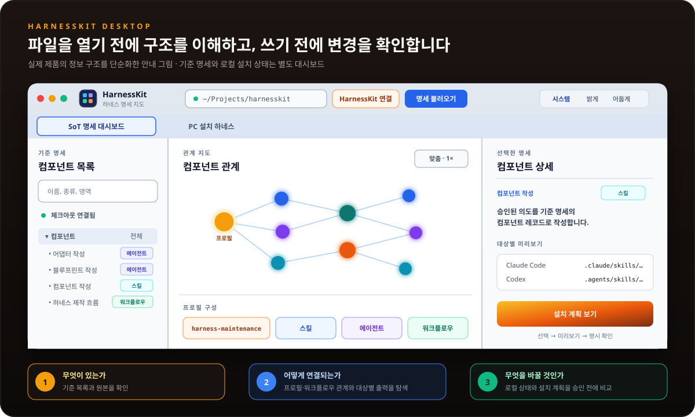
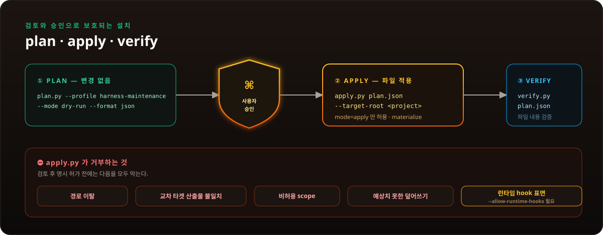
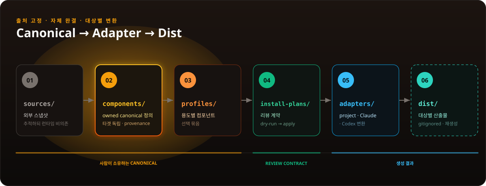

<div align="center">


<h3>AI 개발 도구용 하네스를 한 곳에서 설계하고,<br/>검토한 뒤 프로젝트에 적용하는 툴킷</h3>

<p>
  
  
  
  
</p>

<p>
  <a href="#-desktop-앱">Desktop 앱</a> ·
  <a href="#-cli로-프로젝트에-적용하기">CLI 시작</a> ·
  <a href="#-안전장치와-검증-경계">안전장치</a> ·
  <a href="#-현재-제공하는-구성">제공 구성</a>
</p>

</div>


## HarnessKit은 무엇인가요?

HarnessKit은 AI 개발 도구가 사용하는 **Skill, Agent, Rule, Workflow**를 재사용 가능한 컴포넌트로 관리하는 도구입니다.
출처와 변경 근거를 함께 보존하고, 선택한 구성을 Claude Code, Codex와 Antigravity CLI가 읽는 프로젝트 파일로 변환합니다.

여기서 <strong>하네스(harness)</strong>는 AI 개발 도구가 어떤 절차와 역할, 규칙을 사용해 일할지 정하는 구성 묶음을 뜻합니다.

| 사용자가 겪는 문제 | HarnessKit이 제공하는 해결 방식 |
| --- | --- |
| 여러 프로젝트에 Skill과 Agent 파일이 흩어져 있음 | 하나의 canonical 컴포넌트를 기준으로 대상별 파일을 생성 |
| 어떤 파일이 원본이고 생성물인지 알기 어려움 | `sources → components → profiles → adapters` 경계를 명시 |
| 설치 명령이 기존 파일을 덮어쓸지 불안함 | 먼저 plan을 만들고, 검토한 plan만 project scope에 적용 |
| 파일이 생기면 실제 도구에서도 동작한다고 오해하기 쉬움 | 파일 적용, 파일 검증, runtime 활성화 증거를 별도로 구분 |

> [!NOTE]
> HarnessKit은 대화형 AI 모델이나 자동 실행 오케스트레이터가 아닙니다. 하네스의 **정의·변환·설치 계획·검증 경계**를 관리합니다.

## 🖥️ Desktop 앱

HarnessKit Desktop은 파일과 YAML을 직접 오가며 확인해야 했던 정보를 두 개의 대시보드로 보여주는 Tauri 앱입니다.

<p align="center">
  
</p>

| 대시보드 | 답하는 질문 | 주요 기능 |
| --- | --- | --- |
| **SoT 명세 대시보드** | HarnessKit에는 무엇이 있고 서로 어떻게 연결되는가? | 컴포넌트 탐색, Profile·Workflow 관계 확인, 원본 상세 조회 |
| **PC 설치 하네스** | 내 Mac과 프로젝트에는 무엇이 설치되어 있는가? | Claude Code·Codex·Antigravity·Hermes 표면 탐색, 정의 위치와 원문 확인 |

SoT 조회는 read-only가 기본입니다. 파일을 쓰는 설치·제거 동작은 별도의 계획과 명시적 확인을 거쳐야 하며, 화면에 보였다는 이유만으로 적용 성공이나 runtime 동작을 주장하지 않습니다.

### 개발자용 beta.3: 소스에서 직접 빌드하기

현재 베타는 **개발자 몇 명이 자기 Mac에서 소스를 빌드해 기능을 확인하는 방식**으로 진행합니다. macOS 13 이상 Apple Silicon Mac용이며 Intel Mac은 지원하지 않습니다.

다운로드 DMG는 Apple Developer ID 서명·공증이 없어 실행이 차단될 수 있습니다. 로컬 빌드는 다운로드 DMG와 보안 검사 조건이 다를 수 있지만, 회사 보안 정책이나 모든 Mac에서의 실행 허용을 보장하지는 않습니다. 보안 기능을 끄거나 격리 속성을 제거하지 마세요.

#### 1. 준비 도구 확인

- Xcode Command Line Tools: 없으면 `xcode-select --install` 실행 후 설치 창에서 완료합니다.
- Python 3.11 이상, Node.js 20 이상, `uv`
- Rust 최신 stable과 Tauri CLI 2

```bash
xcode-select -p
python3 --version
node --version
uv --version
rustc --version
cargo tauri --version
```

Rust가 없다면 [공식 rustup 안내](https://rustup.rs/)로 설치합니다. 기존 Rust가 있다면 `rustup update stable`로 갱신하고, Tauri CLI가 없다면 설치합니다:

```bash
cargo install tauri-cli --version "^2" --locked
```

#### 2. 고정된 베타 소스 받기

```bash
git clone --branch v0.1.0-beta.3 --depth 1 https://github.com/pureliture/harnesskit.git harnesskit-beta3
cd harnesskit-beta3
git rev-parse HEAD
```

마지막 명령은 `a5bc523e7c304cdb6dba1c51f10a00a55cc1f76b`를 출력해야 합니다. 태그 checkout의 detached HEAD 안내는 정상입니다. 테스트 소스를 수정하려면 먼저 별도 브랜치를 만드세요.

#### 3. 빌드하기

첫 빌드에는 인터넷 연결과 Rust 의존성 컴파일 시간이 필요합니다. 아래 명령은 선택한 소스 폴더에 산출물을 만들며 `/Applications`에 앱을 설치하거나 기존 도구 설정을 바꾸지 않습니다.

```bash
npm ci --prefix src-frontend --ignore-scripts
python3 scripts/package/prepare_install_runtime.py --repo-root .
python3 scripts/package/prepare_install_runtime.py --repo-root . --verify-only
CI=true uv run --no-project --no-cache python scripts/package/build_verified_macos_package.py --repo-root .
```

빌드 스크립트는 고정 Python 런타임의 해시, 앱·DMG 구성과 arm64 실행 파일을 검사합니다. 마지막 JSON 결과에 `app`, `dmg`, `report` 경로가 나오면 해당 보고서를 확인할 수 있습니다. `CI=true`는 Finder의 DMG 창 배경·아이콘 배치 자동화만 건너뜁니다.

#### 4. 직접 만든 앱 실행하기

```bash
open "src-tauri/target/aarch64-apple-darwin/release/bundle/macos/HarnessKit.app"
```

DMG 설치 없이 빌드된 앱을 실행합니다. 로컬 빌드도 AdHoc 서명이며 공증된 앱은 아닙니다. 실행이 차단되면 보안 정책을 우회하지 말고 오류 문구를 알려주세요.

처음에는 별도 테스트 프로젝트와 설정 파일 사본으로 가져오기를 확인하세요. 가져오기·편집만으로 원본은 바뀌지 않지만, **적용을 승인하면 선택한 실제 파일이 수정**됩니다. 가져오기, 적용 전 차이 확인, 외부 수정 차단과 앱 재시작 후 상태 유지를 테스트합니다. 실제 앱 화면·도구 실행 확인은 테스터 피드백이 필요한 범위입니다.

#### 참고: 다운로드 DMG

[beta.3 Release](https://github.com/pureliture/harnesskit/releases/tag/v0.1.0-beta.3)의 DMG와 `.sha256`은 기존 산출물로 유지합니다. 개발자 테스트의 기본 경로는 위 소스 빌드이며, DMG는 실행 허용이나 배포자 신뢰를 보장하지 않습니다. 직접 만든 앱과 공개 DMG는 빌드 환경 때문에 파일 해시가 다를 수 있습니다.

앱에 포함된 오픈소스 라이선스는 [`THIRD_PARTY_NOTICES.md`](THIRD_PARTY_NOTICES.md)에 있고, 앱 상단의 `오픈소스 라이선스` 링크로도 볼 수 있습니다. 의존성이 바뀌면 `uv run --no-project --with pyyaml python scripts/package/generate_third_party_notices.py`로 고지를 다시 만들어야 합니다.

## 🚀 CLI로 프로젝트에 적용하기

Desktop 앱 없이도 source checkout에서 동일한 install-plan 흐름을 사용할 수 있습니다. 현재 공개 프로필은 HarnessKit 자체를 만들고 정비하는 `harness-maintenance`입니다.

### 요구사항

| 도구 | 버전 | 용도 |
| --- | --- | --- |
| Python | 3.11 이상 | plan, apply, verify 실행 |
| `uv` | 최신 안정 버전 | Python 환경과 의존성 실행 |
| Node.js | 20 이상, 선택 | 로컬 npm tarball CLI 사용 |

### 1. 저장소 받기

```bash
git clone https://github.com/pureliture/harnesskit.git
cd harnesskit
```

### 2. 변경 없이 설치 계획 검토하기

```bash
uv run python scripts/install/plan.py \
  --profile harness-maintenance \
  --scope project \
  --mode dry-run \
  --format json
```

`dry-run` 결과에서 다음 항목을 먼저 확인합니다.

- `artifacts`: 생성되거나 병합될 파일
- `runtime_surfaces`: Claude Code, Codex와 Antigravity CLI가 읽을 위치
- `activation_gates`: 별도 허가가 필요한 실행 표면
- `scope`: 변경이 현재 프로젝트 안으로 제한되는지

### 3. 검토한 계획만 적용하고 확인하기

```bash
uv run python scripts/install/plan.py \
  --profile harness-maintenance \
  --scope project \
  --mode apply \
  --format json > /tmp/harnesskit-plan.json

uv run python scripts/install/apply.py \
  /tmp/harnesskit-plan.json \
  --target-root /path/to/project

uv run python scripts/install/verify.py \
  /tmp/harnesskit-plan.json \
  --target-root /path/to/project
```

`activation_gates`에 runtime hook이 포함된 경우에는 plan을 검토한 뒤에만 `apply.py`에 `--allow-runtime-hooks`를 추가합니다. 현재 `harness-maintenance` project profile은 runtime hook을 설치하지 않습니다.

<details>
<summary><b>방법 2 — 로컬 npm tarball로 <code>harnesskit</code> 명령 사용하기</b></summary>

이 패키지는 현재 npm registry 배포물이 아니라 로컬 tarball용입니다.

```bash
PACKAGE_NAME=$(npm pack --pack-destination /tmp | tail -n 1)
TARBALL="/tmp/$PACKAGE_NAME"

npx --yes --package "$TARBALL" harnesskit plan \
  --profile harness-maintenance \
  --scope project \
  --mode dry-run \
  --format json
```

검토 후 적용할 계획은 별도 파일로 만든 뒤 같은 tarball의 `apply`와 `verify`에 전달합니다.

```bash
npx --yes --package "$TARBALL" harnesskit plan \
  --profile harness-maintenance \
  --scope project \
  --mode apply \
  --format json > /tmp/harnesskit-plan.json

npx --yes --package "$TARBALL" harnesskit apply \
  /tmp/harnesskit-plan.json \
  --target-root /path/to/project

npx --yes --package "$TARBALL" harnesskit verify \
  /tmp/harnesskit-plan.json \
  --target-root /path/to/project
```

`harnesskit` Node.js shim은 내부적으로 `uv`와 Python 구현을 실행하므로 `uv`가 계속 필요합니다.

</details>

## 🔒 안전장치와 검증 경계

<p align="center">
  
</p>

`apply.py`는 다음 변경을 자동으로 거부합니다.

| 거부 조건 | 보호하는 대상 |
| --- | --- |
| `--target-root` 밖으로 나가는 경로 | 다른 프로젝트와 사용자 파일 |
| 서로 다른 target의 artifact 혼합 | Claude Code·Codex·Antigravity CLI 출력 경계 |
| profile이 허용하지 않은 scope | project-local 기본 범위 |
| plan에 없는 덮어쓰기 | 기존 사용자의 파일 |
| 허가되지 않은 runtime hook | 자동 실행 표면 |

성공 상태도 서로 구분합니다.

| 상태 | 확인된 것 | 아직 확인되지 않은 것 |
| --- | --- | --- |
| **Plan 생성** | 예상 파일, scope, 위험 표면 | 실제 파일 변경 |
| **Apply 성공** | plan에 따른 파일 생성·보존 병합 | 대상 CLI가 파일을 읽었는지 |
| **Verify 성공** | 대상 파일이 plan의 기대 내용과 일치 | Skill·Agent·hook의 live 동작 |
| **Runtime proof 확보** | 특정 버전과 trust 상태에서 실제 load·실행 관찰 | 다른 버전·다른 환경의 동작 |

## 🧰 현재 제공하는 구성

공개 `harness-maintenance` profile은 project scope에서 다음 구성을 선택합니다.

| 종류 | 수 | 포함 내용 |
| --- | ---: | --- |
| Skills | 5 | requirements 정리, blueprint 작성, component 저작, adapter 저작, evidence 평가 |
| Agents | 6 | reference 수집부터 requirements·blueprint·component·adapter·evaluation까지 역할 분리 |
| Project Rule | 1 | SoT 우선, 완료 전 검증, CI gate, 안전한 worktree 규칙 |
| Public Workflow | 1 | 승인된 요구에서 검증까지 이어지는 `harness-creation` 흐름 |

설치 대상은 다음과 같습니다.

| Target | 생성되는 주요 표면 |
| --- | --- |
| Project | `AGENTS.md`, `CLAUDE.md`의 HarnessKit managed block |
| Claude Code | `.claude/skills/**`, `.claude/agents/**` |
| Codex | `.agents/skills/**`, `.codex/agents/**`, `.codex/config.toml` |
| Antigravity CLI | `.agents/skills/**` |

정확한 목록은 [`profiles/harness-maintenance.yml`](profiles/harness-maintenance.yml)과 [`components/registry.yml`](components/registry.yml)에서 확인할 수 있습니다. Workflow는 설치 Profile의 member가 아니라 공개 대상으로 별도 선택되는 독립 정의입니다.

## 🧬 어떻게 작동하나요?

<p align="center">
  
</p>

| 경로 | 역할 | 사용자가 직접 수정하는가? |
| --- | --- | --- |
| `sources/` | 참조한 외부 source와 provenance 기록 | 출처를 갱신할 때만 |
| `components/` | HarnessKit이 소유하는 canonical 정의 | 예 |
| `profiles/` | 목적별 component 선택 | 예 |
| `adapters/` | canonical 정의를 target 형식으로 변환 | target 지원을 바꿀 때 |
| `dist/` | 재생성 가능한 target별 결과 | 아니요 |
| 설치 대상 프로젝트 | 검토한 plan이 materialize한 파일 | plan을 통해 변경 |

## 📌 현재 범위와 주의사항

- 제품과 공개 profile은 아직 `preview`/`draft` 단계이고, Desktop 앱은 베타입니다.
- npm registry package가 아니므로 `npm install -g harnesskit` 경로를 제공하지 않습니다.
- 저장소 루트에 프로젝트 전체를 포괄하는 `LICENSE` 파일이 추가되기 전에는 공개 소스를 곧바로 재사용 허가로 해석하지 마세요.
- Adapter build와 파일 verify는 target runtime에서의 실제 load·실행을 대신 증명하지 않습니다.

문제가 있거나 사용 흐름이 모호하면 [GitHub Issues](https://github.com/pureliture/harnesskit/issues)에 재현 환경, 사용한 profile, plan mode와 실패 메시지를 함께 남겨 주세요. credential, 전체 환경 변수, 개인 경로가 포함된 raw log는 올리지 마세요.

## 더 살펴보기

- [`components/workflows/harness-creation/card.md`](components/workflows/harness-creation/card.md) — HarnessKit 제작 흐름
- [`sources/requirements.md`](sources/requirements.md) — 공개 HarnessKit 요구사항
- [`sources/blueprint.md`](sources/blueprint.md) — canonical component와 adapter 구조
- [`publish/harnesskit.yml`](publish/harnesskit.yml) — 공개 projection 범위

<div align="center">


<sub>정의는 한 번 · 변경은 검토 후 · 성공은 증거로</sub>

</div>
