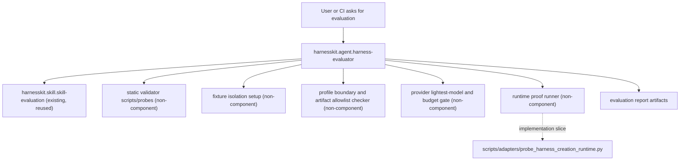

# Harness Evaluator Blueprint

## Inputs

Approved source of truth:

- `sources/requirements.md` with `Approval Status: approved-for-blueprint`

Required references read:

- `sources/harness-evaluation-reference.yml`
- `sources/harness-evaluation-oss-reference.yml`
- `components/registry.yml`
- `profiles/engineering.yml`
- `profiles/harness-maintenance.yml`
- `profiles/minimal.yml`
- `capabilities.yml`
- `components/harness/workflows/harness-creation/workflow.yml`

Approved requirement anchor:

> HarnessKit 하네스 평가 체계의 top-level 총괄자는 하네스 평가 에이전트 1개로 둔다.

Reference use is pattern-only. The reference packets do not approve copied content, license reuse, or runtime support claims.

Current registry and residue policy:

- Earlier draft `rh.*` entries/files for evaluator, hook, rule, and workflow are residue relative to this blueprint.
- Keeping those drafts is explicitly forbidden. Later authoring must remove or replace them with the approved `harnesskit.*` slice; it must not leave both namespaces or unused draft component families behind.
- The hook/rule/command candidates are rejected for this blueprint because requirements call for an orchestrating evaluator and `capabilities.yml` keeps Codex rule/command support probe-gated.

## Component Graph

Required new component:

- `harnesskit.agent.harness-evaluator`

Existing components reused:

- `harnesskit.skill.skill-evaluation`
- `harnesskit.skill.harness-blueprint`
- `harnesskit.agent.harness-blueprint-author`
- `harnesskit.workflow.harness-creation` as the existing lifecycle reference, not a runner for this evaluator

Non-component implementation collaborators:

- Static validator scripts.
- Deterministic fixture setup and teardown helpers.
- Artifact allowlist checker.
- Profile boundary contamination checker.
- Provider lightest-model and budget gate.
- Runtime proof runner, including future repositioning of `scripts/adapters/probe_harness_creation_runtime.py`.

## Component Decisions

| id | kind | reason | owner | inputs | outputs | non-responsibilities |
| --- | --- | --- | --- | --- | --- | --- |
| `harnesskit.agent.harness-evaluator` | agent | Top-level orchestration needs isolated context, delegated execution planning, evidence aggregation, and verdict reporting. Rejected `skill` because this is not only reusable instructions. Rejected `workflow` because a card is not a runner. Rejected `command`, `hook`, and `rule` because requirements do not require new interception or CLI schema, and Codex command/rule support is probe-gated. | HarnessKit maintenance | Approved requirements, blueprint, registry, profiles, capabilities, target component/profile/workflow scope, static validator output, runtime proof artifacts, fixture metadata | Evaluation report artifacts only: Markdown/HTML report, JSON result, JSONL/log trace, sanitized evidence, fixture-local metadata | Source or canonical edits, registry/profile mutation, adapter output generation, hook interception, rule enforcement, CLI command implementation, destructive git operations, automatic fixes |

Rejected alternatives:

- `harnesskit.workflow.harness-evaluation`: optional human-readable card only. Not required now because the approved requirement names one top-level evaluator and the existing `harness-creation` workflow already shows the SoT-to-evaluation lifecycle. Can be reconsidered later as a non-runner card.
- `harnesskit.command.harness-eval`: not selected. Custom command support is pending schema probe in `capabilities.yml`.
- `harnesskit.hook.harness-evaluation-safety-guard`: not selected. Fixture and allowlist safety should be deterministic runner behavior, not implicit interception.
- `harnesskit.rule.harness-evaluation-budget`: not selected. Budget and timeout policy belongs in evaluator instructions and runner configuration until rule support is proven.

## Responsibility Boundaries

`harnesskit.agent.harness-evaluator` owns:

- Evaluation plan assembly for component, profile, workflow, or full E2E scope.
- Calls to the existing `skill-evaluation` gate procedure.
- Separation of static proof, runtime proof, report artifact, source scope, and evidence namespace.
- Static validation coordination across registry, requirements, blueprint, provenance, profile closure, install-plan/profile output scope, and adapter static outputs.
- Runtime proof coordination only inside isolated fixtures or temporary workspaces.
- Fixture isolation expectations: seed copy must exclude tracked `.agents/**`, `.claude/**`, and `.codex/**` runtime surfaces, or must clean target runtime surfaces before selected profile apply.
- Profile boundary contamination detection. If selected profile is `harness-maintenance` and `optimal-response` appears in the E2E runtime skill/agent/hook surface, verdict must fail.
- Provider model/budget enforcement. Runtime tests must use the approved lightest model class for each provider, such as Codex mini/nano class and Claude haiku class, and must fail before execution if the selected model is missing, too expensive, or not explicitly allowed.
- Output allowlist enforcement for reports, logs, JSON, JSONL, HTML, sanitized evidence, and fixture-local metadata only.
- Verdict aggregation into `PASS`, `PASS_WITH_DEFERRED`, `NEEDS_WORK`, or `BLOCKED`.

`harnesskit.agent.harness-evaluator` does not own:

- Editing `sources/**`, `components/**`, `components/registry.yml`, `profiles/**`, `scripts/**`, `tests/**`, `dist/**`, `.agents/**`, `.claude/**`, or `.codex/**`.
- Creating hook, rule, command, workflow, adapter output, install output, or generated distribution files.
- Claiming runtime support from static proof.
- Running live proof outside an isolated fixture.
- Fixing discovered defects.
- Committing, merging, pushing, cleaning worktrees, or deleting files.

`harnesskit.skill.skill-evaluation` remains:

- A reused gate/report procedure and judgment rubric.
- Not the top-level runner.
- Not responsible for fixture setup, runtime process cleanup, or output allowlist enforcement unless called by the evaluator as one gate input.

## Files To Author

Required canonical component files for the new agent:

- `components/harness/agents/harness-evaluator/agent.yml`
- `components/harness/agents/harness-evaluator/prompt.md`
- `components/harness/agents/harness-evaluator/provenance.map.yml`

Registry and profile follow-up after canonical authoring:

- Add `harnesskit.agent.harness-evaluator` to `components/registry.yml` only after the component files exist and namespace migration policy is explicit.
- Add the evaluator to the HarnessKit maintenance profile only if profile closure proves its adapter outputs do not pull unrelated engineering components.
- Do not add `optimal-response` to the maintenance profile as part of this evaluator.

Files explicitly not to author in this blueprint:

- `components/hooks/harness-evaluation-safety-guard/**`
- `components/rules/harness-evaluation-budget/**`
- `components/harness/workflows/harness-evaluation/**`
- Command component files.
- Adapter outputs under `.agents/**`, `.claude/**`, `.codex/**`, or `dist/**`.

## Profile And Install Plan

Profile placement intent:

- `harnesskit.profile.harness-maintenance`: target profile for `harnesskit.agent.harness-evaluator` because this evaluator is a HarnessKit maintenance capability.
- `harnesskit.profile.engineering`: do not include by default. It contains `optimal-response`, which is useful for engineering workflows but must not contaminate maintenance fixture evaluation.
- `harnesskit.profile.minimal`: no evaluator by default.

Profile boundary gate:

- Build the expected installed runtime surface from the selected profile closure.
- Compare actual fixture/runtime surfaces after profile apply.
- Fail if any skill, agent, hook, workflow, rule, or command outside selected profile closure appears.
- Required negative canary: `harness-maintenance` E2E workspace containing `optimal-response` skill or adapter output fails as profile-boundary contamination.

Install plan constraints:

- Evaluator install is project-scoped only.
- No automatic user-level install.
- No implicit hook or command registration.
- Fixture seed copy must not carry tracked runtime surfaces from the source repo into the target before selected profile apply.

## Adapter Target Plan

Target intent:

- Codex agent adapter: produce project-scoped agent registration and config-layer output according to `capabilities.yml` agent support.
- Claude agent adapter: produce project-scoped `.claude/agents/<name>.md` output according to `capabilities.yml` agent support.

Adapter exclusions:

- No Codex rule adapter output.
- No Codex command adapter output.
- No new Codex hook adapter output.
- No Claude hook adapter output.
- No workflow runner adapter output.

Runtime truth:

- Agent adapter static output is not runtime proof.
- Runtime proof for the evaluator must use isolated workspace evidence with timeout, budget, sanitized event capture, process cleanup result, fixture id, target, command summary, and verdict.
- Runtime proof must record provider, selected lightest model, allowed model class, effort, live-call ceiling, timeout, and rejection reason when the model/budget gate blocks execution.
- `scripts/adapters/probe_harness_creation_runtime.py` should be repositioned in implementation as a reusable runtime proof runner called by the evaluator. It is not a command component.

## Provenance Plan

Primary provenance:

- `sources/requirements.md` is the approved requirements SoT.
- `sources/harness-evaluation-reference.yml` provides local reusable patterns from `skill-evaluation`, runtime probes, Codex app-server probing, and smoke-test structure.
- `sources/harness-evaluation-oss-reference.yml` provides OSS pattern influence only.

Source influence boundaries:

- Inspect AI pattern: separate task/solver/scorer/sandbox/log concepts.
- SWE-bench pattern: verify behavior in isolated runtime fixtures.
- promptfoo pattern: assertions and portable reports.
- DeepEval pattern: pytest-like evaluation structure.
- Langfuse pattern: trace and score separation.
- OpenAI Evals pattern: system-under-test adapter boundary.
- AgentBench pattern: separate environment state from agent action.

Provenance rules:

- No reference code or content copy.
- Keep source uncertainty metadata: URL/path, observed ref, license field, copied-content policy, runtime support status.
- Provenance must show which patterns influenced evaluator responsibilities, fixture isolation, report structure, and proof separation.

## Evaluation Gates

Requirements coverage gate:

- Evaluator is the single top-level orchestration entrypoint.
- `skill-evaluation` is reused but not promoted to runner.
- Static proof and runtime proof are separate.
- Output allowlist and source mutation ban are explicit.

Blueprint conformance gate:

- Exactly one required new component is authored: `harnesskit.agent.harness-evaluator`.
- No hook/rule/command component is authored from this blueprint.
- Optional workflow card remains deferred unless a later blueprint revision selects it.

Static proof gate:

- Registry id, component kind, paths, provenance, profile placement, and adapter target metadata are internally consistent.
- Profile closure contains only selected profile components.
- Adapter static outputs are parseable and scoped to agent surfaces only.
- Static proof cannot mark runtime proof passed.
- Static proof evidence includes command/result metadata, checked files, selected profile, target surface list, and unresolved deferrals.

Source/provenance gate:

- Each referenced OSS/local source is recorded with source mode, URL or path, observed ref when available, copied-content policy, and runtime-support uncertainty.
- No copied source text or code is introduced by the evaluator component.

Fixture isolation gate:

- Seed copy excludes or cleans `.agents/**`, `.claude/**`, and `.codex/**` runtime surfaces before profile apply.
- Fixture setup/teardown is deterministic.
- File watcher or manifest diff detects writes outside the allowed fixture output family.
- The fixture starts from a clean target surface manifest and records before/after file inventories.

Profile contamination gate:

- Positive fixture confirms selected profile components appear.
- Negative fixture confirms non-selected components do not appear.
- `harness-maintenance` plus `optimal-response` in runtime surface is a hard failure.
- Any profile mismatch reports expected closure, actual artifacts, unexpected artifacts, missing artifacts, and fixture path.

Output allowlist gate:

- Allowed: report, log, JSON, JSONL, HTML, sanitized evidence, fixture-local metadata.
- Forbidden: source, canonical component files, registry, profiles, scripts, tests, adapter outputs, generated install surfaces.
- Any forbidden write produces `NEEDS_WORK` or `BLOCKED` depending on severity and cleanup confidence.

Model and budget gate:

- Runtime/E2E tests must declare provider, selected model, allowed lightest model class, effort, timeout, and live-call ceiling before starting.
- Codex tests must use an explicitly approved mini/nano class model unless a later policy updates the allowlist.
- Claude tests must use an explicitly approved haiku class model unless a later policy updates the allowlist.
- Missing model selection, expensive default fallback, effort above the approved cap, absent timeout, or absent live-call ceiling fails before live execution.

Runtime proof gate:

- Runtime proof runs only in isolated fixture or temporary workspace.
- Evidence records fixture id, target, command summary, sanitized event log path, timeout/budget result, process cleanup result, verdict, deferred items, and required fixes.
- Raw secrets, raw environment dumps, private path inventories, and credential-like strings are forbidden.

Report gate:

- Report separates static result, runtime result, skipped/deferred proof, profile contamination findings, output allowlist violations, findings, required fixes, and generated artifact list.
- Verdict is reproducible from gate evidence and findings.
- `PASS_WITH_DEFERRED` is allowed only when deferred runtime gates are explicit and non-blocking.

Regression gate:

- Include positive and negative fixtures for profile closure.
- Include forbidden output write fixture.
- Include static-pass/runtime-deferred fixture.
- Include runtime trace-without-score fixture to prove trace existence is not score success.
- Include provider-model rejection fixture for an unset or non-lightest runtime model.
- Include draft-residue fixture proving old `rh.*` evaluator/hook/rule/workflow draft files are absent before authoring proceeds.

## Deferred Work

Deferred runtime gates:

- Isolated Codex runtime proof for the new evaluator agent after canonical authoring and static adapter output exist.
- Isolated Claude runtime proof for the new evaluator agent after canonical authoring and static adapter output exist.
- Full E2E profile contamination proof until fixture isolation and allowlist checker implementation exists.
- Runtime proof runner extraction/repositioning around `scripts/adapters/probe_harness_creation_runtime.py`.

Deferred component decisions:

- `harnesskit.workflow.harness-evaluation` remains deferred as an optional human workflow card, not a runner.
- Hook/rule/command components remain rejected for this blueprint. Reconsider only after requirements change and target support is proven or explicitly gated.

Current conflict to resolve during later authoring:

- Draft working-tree registry/files that use `rh.*` ids for evaluator, workflow, hook, and rule are not allowed to remain. Later component authoring must start from the approved `harnesskit.agent.harness-evaluator` slice with no stale hook/rule/workflow draft residue.

## Handoff To Component Authoring

Slice 1: evaluator agent canonical component.

- Component id: `harnesskit.agent.harness-evaluator`
- Kind: agent
- Title: Harness Evaluator
- Summary: Top-level HarnessKit evaluation orchestrator that calls existing gate procedure, deterministic validators, fixture isolation, allowlist/profile contamination checks, runtime proof runner, and report generation without modifying source or canonical files.
- Source influence: approved requirements; local `skill-evaluation` gates; local runtime probe patterns; OSS evaluation architecture patterns as structure-only references.
- Owned output family: canonical evaluator agent files under `components/harness/agents/harness-evaluator/`.
- Files to create/update: `agent.yml`, `prompt.md`, `provenance.map.yml`.
- Explicit non-responsibilities: hook/rule/command/workflow authoring, adapter outputs, runtime probes, script implementation, tests, registry/profile migration unless separately approved for the authoring step.
- Evaluation gates: requirements coverage, blueprint conformance, source/provenance, agent body quality, boundary safety, profile contamination contract, output allowlist contract, deferred runtime truth reporting.

Non-component implementation slices for later phases:

- Static validator integration: wire registry/profile/provenance/profile-closure checks and source-scope checks into deterministic scripts.
- Fixture isolation and allowlist checker: ensure clean runtime surfaces and forbidden write detection.
- Runtime proof runner: reposition `probe_harness_creation_runtime.py` as evaluator-callable runtime proof runner, not as command component.
- Report artifact generator: emit JSON, JSONL/log, Markdown or HTML report with separated static/runtime/deferred evidence.
